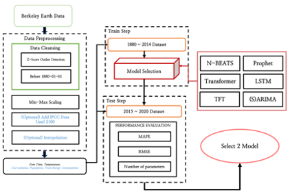
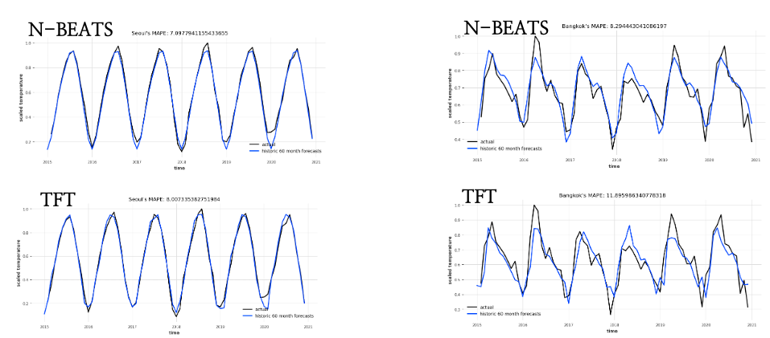
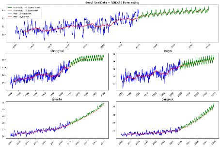
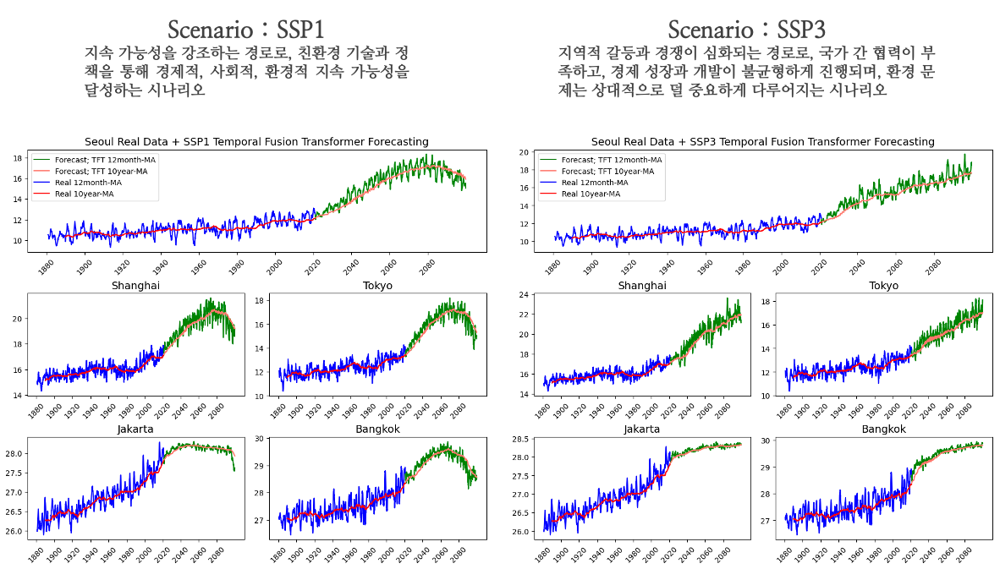

## Capstone Project : Temperature Forecast for Five Asian Cities in the Year 2100
### latest version : 2024/06/30 by JuYeon

### 📌 Description
- 아시아 5개 도시(Seoul, Shanghai, Tokyo, Bangkok, Jakarta)의 2100년 기온 예측
- Time Series Forecasting을 위해 고안된 Deep Learning 모델 사용
- Data from **Berkely Earth**(https://berkeleyearth.org/data/)
    - Use **local temperature**
- Data from **Our World in Data**(https://ourworldindata.org/grapher/global-primary-energy)
    - Use **SSP scenario**
- Framework : **PyTorch**
- model type : Temporal Fusion Transfomer(TFT) / N-BEATS / Transformer / Prophet
- Flow Chart

### 📌 Directorys & Files
- data : raw data & ipynb to make csv file
- NBEATS_model : NBEATS models using Darts's Lib
- TF_model : transformer models implemented by author
- TFT_model : temporal fusion transformer models using Darts's Lib
- plot : 시각화 자료 모음

### 📌 Result
- TFT 모델과 N-BEATS 모델이 테스트 기간 5년에 대하여 가장 납득할 만한 성능을 보여줌

- 따라서, TFT 모델과 N-BEATS 모델로 2100년 기온 예측 진행

